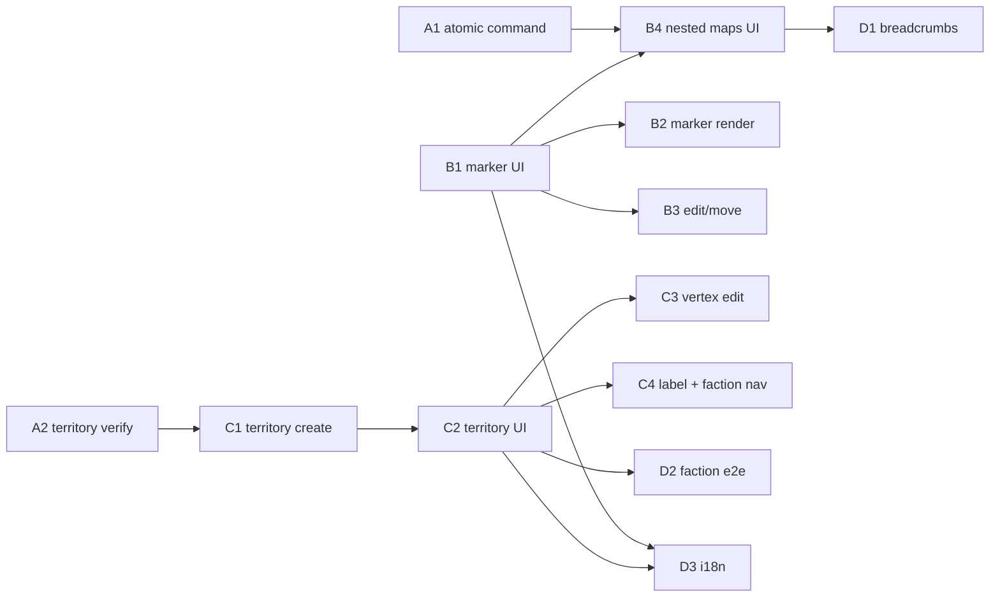

# 0.3.1.x — Трек 1: Canvas parity («Карта» → «Холст»)

**Статус:** в работе (parity)  
**Следующий шаг:** **B4 / PR1** — breadcrumbs + navigation stack helper (A1–B3, C1 сделаны; см. `docs/plans/0.3.2-canvas-architecture.md` PR1).  
**Architecture docs:** ADR-0004 Proposed (`f9061dfc0`); migration 018+ после Accepted.

---

## Контекст и цель

При переходе «Карта» → «Холст» (см. `docs/canvas-functional-gaps.md`) удалены core-UI и flows маркеров, территорий и вложенных карт. Pixi-canvas и backend canvas-модель (`75e093703`, миграция `017`) уже есть; **parity не восстановлен**.

**Трек 1** возвращает функционал, который **был** в «Карте» (`HEAD`: `MapMarkerDialog`, `MapTerritoryDialog`, nested maps через `childMapId`), адаптированный под `canvas_object` / `canvas_scene`. **Новый дизайн не добавляем** — это Трек 2 / 0.3.2.

**Источники истины:**

| Что | Где |
|-----|-----|
| Список регрессий, старые поля, backend-аудит | `docs/canvas-functional-gaps.md` |
| Эталон UI/flow старой «Карты» | `git show HEAD:frontend/src/pages/maps/...` |
| Runtime-долг (не в scope) | `docs/canvas-debt.md` |

**Зафиксированные решения (не пересматривать):**

1. Территория = `kind: 'territory'` (не `polygon`; `polygon`/`polyline` — для рек/маршрутов и прочих примитивов).
2. Вложенные карты — **CORE**: дочерняя сцена у маркера, переход, breadcrumbs.
3. Связь маркер → дочерняя сцена — **одна атомарная backend-команда** (транзакция), не три фронт-вызова.
4. Настройки — `content_json` / `style_json` + FK (`linked_note_id`, `linked_scene_id`); **миграция схемы не нужна**.
5. Faction↔territory sync работает с `kind = 'territory'` без правки SQL (`factions.rs`, `list_territory_summaries`).

---

## Связанный план (Трек 2)

Схема и продукт «Холст + карточка карты» — **`docs/plans/0.3.2-canvas-architecture.md`**
(ADR-0004, migration 018+). Parity PR1–PR3 могут мержиться до принятия ADR;
миграция 018+ — только после PR4 (ADR Accepted).

Вложенные карты через **marker** + `canvas_markers_attach_child_scene` остаются в parity;
`scene_container` их **не заменяет** (карточка на Холсте — отдельно, 0.3.2).

---

## Out of scope (Трек 2 / 0.3.2 architecture)

Явно **не делаем** в Треке 1:

- `scene_type`, `scene_container`, migration 018+ (см. 0.3.2 plan).
- Редактируемый plain `text`, слияние `text` + `curve_text`.
- Объединение `rectangle` / `ellipse` / `polyline` под «фигуру», общий shape-инспектор.
- Resize handles для произвольных объектов.
- Incremental reconciler, viewport culling, runtime-долг из `docs/canvas-debt.md`.
- Polyline UX (кнопка может остаться как сейчас; parity polyline не требуется).
- Context panel SD02, слои CV04, режимы CV06.
- Data-migration legacy `maps` → `canvas_*` для старых БД (отдельная задача, если понадобится).

---

## Подзаход A — Backend (минимум)

### A1. Атомарная команда: дочерняя сцена для маркера

**Тип:** backend · **Размер:** **M**

- [x] **A1** — одна транзакция: marker (existing или уже создан) + child scene + `linked_scene_id`

| | |
|--|--|
| **Имя команды (IPC)** | `canvas_markers_attach_child_scene` |
| **Rust handler** | `canvas_markers_attach_child_scene_command` в `src-tauri/src/commands/canvas.rs` |
| **DTO вход** | `AttachChildSceneToMarkerInput` в `src-tauri/src/models/canvas.rs`: `markerId`, `parentSceneId`, `sceneName`, `backgroundPath?`, `branchId?` — при создании маркера вместе со сценой расширить отдельным полем `CreateMarkerWithChildSceneInput` **или** требовать существующий `markerId` (минимальный вариант: только attach к существующему маркеру; создание маркера — отдельный `canvas_objects_create`, затем attach в одном UX-шаге через одну команду attach). **Рекомендация:** `AttachChildSceneToMarkerInput { marker_id, scene_name, background_path?, branch_id? }` — parent scene/object берутся из marker.scene_id и marker.id. |
| **DTO выход** | `{ marker: CanvasObject, childScene: CanvasScene }` |
| **Repository** | `attach_child_scene_to_marker()` в `src-tauri/src/repositories/canvas.rs` |
| **Регистрация** | `src-tauri/src/lib.rs`, `src-tauri/src/specta.rs` |
| **Frontend** | `canvasApi.attachChildSceneToMarker(...)` в `frontend/src/api/canvas.ts` |
| **Codegen** | `npm run tauri:codegen` → `frontend/src/types/generated/bindings.ts` |

**Порядок в транзакции (циклический FK):**

1. `BEGIN`
2. Проверить marker (`kind = 'marker'`), `linked_scene_id IS NULL` (или idempotent replace — зафиксировать в реализации).
3. `INSERT canvas_scene` с `parent_scene_id = marker.scene_id`, `parent_object_id = marker.id`, `name`, опционально `background_path`; создать default layers (`Background`, `Content`) как в `create_root_scene_for_project`.
4. `UPDATE canvas_object SET linked_scene_id = ? WHERE id = marker.id`
5. `COMMIT`

**Риск:** циклический FK `canvas_scene.parent_object_id` ↔ `canvas_object.linked_scene_id` — порядок выше обязателен; при ошибке на шаге 4 — rollback.

**Тесты:**

- Rust unit/integration в `repositories/canvas.rs` или `src-tauri/tests/`: attach создаёт scene + обновляет marker; повторный attach → ошибка или replace (выбрать одно).
- `cargo test`; ручной smoke: invoke из devtools / минимальный тест-кейс.

---

### A2. Проверка: `kind = 'territory'` обслуживается без правок SQL

**Тип:** backend · **Размер:** **S**

- [x] **A2** — верификация по аудиту (не разработка, чеклист регрессии backend)

| Проверка | Файл | Ожидание |
|----------|------|----------|
| CREATE/UPDATE с `kind: 'territory'` | `repositories/canvas.rs` → `validate_object_kind`, `create_object`, `update_object` | OK |
| Reconcile upsert territory | `reconcile_scene` | OK |
| Territory summaries | `list_territory_summaries` (`kind = 'territory'`) | Видит объекты |
| Faction sync | `factions.rs` → `sync_state_territories`, `list_territories_internal` | `factionId` в `content_json`, kind territory |
| Geometry rings | `geometry_json.rings` (массив контуров) | Согласовать с reconciler (territory branch vs polygon points) |

**Действие:** прогнать существующие `cargo test`; при отсутствии тестов territory — добавить **один** integration test create territory + `list_territory_summaries` (в рамках A2, маленький дифф).

**Риск:** reconciler сейчас рисует territory через общую polygon-ветку (`geometry.rings[0]` vs `points`) — при реализации C1/C4 сверить парсинг rings.

---

## Подзаход B — Frontend: Маркер

### B1. Диалог и панель настроек маркера

**Тип:** frontend · **Размер:** **L**

- [x] **B1** — восстановить `MapMarkerDialog` + `MapMarkerPanel` по HEAD, адаптировать под canvas API

| | |
|--|--|
| **Эталон** | `HEAD:MapMarkerDialog.tsx`, `MapMarkerPanel.tsx`, `mapUtils.ts` (`MARKER_ICONS`, `MARKER_COLORS`, `DEFAULT_FORM`) |
| **Новые/изменённые файлы** | `frontend/src/pages/maps/components/CanvasMarkerDialog.tsx`, `CanvasMarkerPanel.tsx` (или вернуть имена Map*); константы icons/colors — `canvas/canvasModel.ts` или `components/canvasConstants.ts` |
| **Поля** | title, description → `content_json`; icon → `content_json.icon`; color → `style_json.fill`; linkedNoteId → **`linked_note_id`** колонка; preview блок |
| **Данные** | `notesApi.getAll(projectId)` для Autocomplete (как `useMapData.ts` в HEAD) |
| **Persist** | `canvasApi.updateObject` / `reconcileScene` через `objectToUpsert` |
| **Flow создания** | Клик в режиме marker → **диалог** (не instant create с дефолтами); Save → `createObject` + поля |
| **Flow редактирования** | Select → боковая панель → Edit → диалог |

**Тест:** шаги 1–2 приёмочного сценария.

**Риск:** дублирование title в `name` vs `content_json.title` — зафиксировать mapping (рекомендация: `content_json.title` + mirror в `object.name` для toolbar label).

---

### B2. Рендер маркера: icon + label на canvas

**Тип:** frontend · **Размер:** **M**

- [x] **B2** — emoji + подпись + badges (note / child scene)

| | |
|--|--|
| **Файл** | `frontend/src/pages/maps/canvas/canvasReconciler.ts` — ветка `marker` / `icon` |
| **Эталон рендера** | `HEAD:MapMarkerOnMap.tsx` — круг 32px, emoji, title снизу, badges note/child |
| **Читать** | `content_json.icon`, `content_json.title`, `style_json.fill`, `linked_note_id`, `linked_scene_id` |
| **Hit-test** | bbox вокруг icon+label (не только circle radius) |

**Тест:** шаг 1 сценария — иконка и подпись видны после save.

**Риск:** пересоздание display при selection (DEBT-004) — не чинить в Треке 1, но проверить что emoji не мигает критично.

---

### B3. Edit после создания + move

**Тип:** frontend · **Размер:** **S**

- [x] **B3** — parity drag и reopen edit

| | |
|--|--|
| **Edit** | Панель + диалог (B1); убрать заглушку context menu «Edit» → snackbar (`MapPage.tsx:668–671`) |
| **Move** | Drag в `select` уже есть (`PixiMapCanvas`); опционально marker-mode drag как HEAD — **минимум:** move в select + persist `transform_json` |
| **Persist move** | `persistObject` / `reconcileScene` на pointer up |

**Тест:** шаг 2 сценария; маркер остаётся на месте после reload (шаг 3).

---

### B4. Вложенная карта: create, navigate, breadcrumbs

**Тип:** frontend · **Размер:** **L**

- [ ] **B4** — nested maps CORE (зависит от **A1**); breadcrumbs + open child map из панели — **частично** (PR1)

| | |
|--|--|
| **Create** | В диалоге маркера (create) и панели (existing): «Создать вложенную карту» → **`canvasApi.attachChildSceneToMarker`**; опционально upload фона → `canvasApi.uploadSceneBackground` |
| **Navigate** | Double-click / кнопка «Открыть» в панели → `navigate(/project/:id/map/:sceneId)` (route уже `mapId` param в `MapPage.tsx`) |
| **Breadcrumbs** | Восстановить по HEAD `MapToolbar` breadcrumbs из `canvasApi.getSceneTree`; back parent, клик по crumb |
| **Эталон** | `HEAD:MapToolbar.tsx`, `useMapNavigation.ts`, `MapMarkerPanel.sectionChildMap` |

**Тест:** шаг 3 сценария целиком.

**Риск:** route param `mapId` vs `sceneId` naming — не переименовывать route в Треке 1.

---

## Подзаход C — Frontend: Территория

### C1. Создание `kind: 'territory'` (не polygon)

**Тип:** frontend · **Размер:** **M**

- [x] **C1** — режим рисования территории + save как territory

| | |
|--|--|
| **Изменить** | `MapPage.tsx`: `createPolygon` → `createTerritory` с `kind: 'territory'`, `geometry_json: { rings: [points] }`, `defaultTerritoryObject` из `canvasModel.ts` |
| **Toolbar** | Режим `draw_territory` (как HEAD) **или** переименовать `polygon` tool в UI «Территория» с kind territory — **не** путать с примитивом polygon для рек |
| **Finish draw** | После finish → **диалог** настроек (C2), не instant save |
| **Reconciler** | Убедиться что `geometry.rings` рисуется для territory (multi-ring ready) |

**Тест:** шаг 4 начало — объект в БД с `kind = 'territory'`.

---

### C2. Диалог и панель территории

**Тип:** frontend · **Размер:** **L**

- [ ] **C2** — `MapTerritoryDialog` + `MapTerritoryPanel` по HEAD

| | |
|--|--|
| **Эталон** | `HEAD:MapTerritoryDialog.tsx`, `MapTerritoryPanel.tsx` |
| **Поля → storage** | name → `object.name`; description, factionId → `content_json`; fill, opacity, borderColor, borderWidth → `content_json` **и/или** `style_json` (mirror для reconciler: fill/opacity/stroke в `style_json` для Pixi, faction metadata в `content_json`) |
| **factionId** | Autocomplete `factionsApi.getAll`; при выборе — автоподстановка fill/border из `faction.color` |
| **Smoothing** | `content_json.smoothing`; reconciler — **если smoothing не был в Pixi** — портировать логику из HEAD `MapTerritorySvg` / dialog preview |

**Тест:** шаг 4 — подпись, цвет от фракции.

---

### C3. Edit вершин + multi-ring

**Тип:** frontend · **Размер:** **L**

- [ ] **C3** — vertex edit + complete contour

| | |
|--|--|
| **Эталон** | `HEAD:useMapTerritoryCrud.ts`, `useMapTerritoryDrawing.ts`, `useMapInteractions.ts` (insert/delete vertex, edit shape mode) |
| **Pixi** | Handles на вершинах в `PixiMapCanvas` или overlay; persist `geometry_json.rings` через `updateObject` |
| **Multi-ring** | Toolbar «Complete contour» + finish с несколькими rings (HEAD `MapToolbar.completeContour`) |
| **Esc / guards** | HEAD `useMapInteractions` esc и mode guards |

**Тест:** шаг 6 сценария.

**Риск:** сложность vertex UX в Pixi vs старый SVG — самый большой frontend-риск Трека 1.

---

### C4. Подпись на canvas + навигация к фракции

**Тип:** frontend · **Размер:** **M**

- [ ] **C4** — label + link to faction page

| | |
|--|--|
| **Label** | Порт `territoryLabelMetrics` из HEAD `mapUtils.ts` → reconciler territory branch (Pixi `Text` по centroid largest ring) |
| **Panel** | Секция ownership → `navigate` на страницу фракции/государства (как HEAD `onNavigateToFaction`) |
| **Faction page** | Шаг 5 — territory в связке state↔territory (`factions` UI + backend sync) |

**Тест:** шаги 4–5 сценария.

---

## Подзаход D — Интеграция и i18n

### D1. Breadcrumbs и навигация по дереву сцен

**Тип:** frontend · **Размер:** **M**

- [ ] **D1** — `getSceneTree` + toolbar crumbs (может пересекаться с B4; выполнить один раз)

**Файлы:** `MapToolbar.tsx`, `MapPage.tsx`, `canvasApi.getSceneTree`.

---

### D2. Faction ↔ territory end-to-end

**Тип:** frontend + manual QA · **Размер:** **S**

- [ ] **D2** — после C2 сохранить territory с `factionId`; на странице государства/фракции территория в списке

**Проверка:** `factionsApi` update state with `territoryIds` или автосync через `content_json.factionId` (как HEAD — territory хранит factionId; страница фракции читает через backend list).

---

### D3. i18n

**Тип:** frontend · **Размер:** **S**

- [ ] **D3** — восстановить/адаптировать ключи из HEAD `map.json` (markerDialog, territoryDialog, panels, breadcrumbs, nested map strings) под namespace `map:canvas.*` или вернуть старые ключи где parity 1:1

**Файлы:** `frontend/src/i18n/locales/en/map.json`, `ru/map.json`.

---

## Порядок выполнения и зависимости

| Порядок | Подзаход | Блокер |
|---------|----------|--------|
| 1 | **A1**, **A2** | — |
| 2 | **B1**, **C1** | параллельно после A2 |
| 3 | **B2**, **B3**, **C2** | после B1 / C1 |
| 4 | **B4**, **C3**, **C4** | B4 после A1 |
| 5 | **D1–D3** | интеграция |

**A1 обязателен до B4.** Остальное — параллелится с осторожностью на общих файлах (`MapPage.tsx`, `canvasReconciler.ts`).

---

## Приёмочный критерий закрытия 0.3.1

**0.3.1 закрывается ТОЛЬКО когда все 6 шагов проходят** (ручной smoke на desktop Tauri):

1. Создать маркер → задать title, icon, color, привязать заметку → сохранить → маркер на canvas показывает иконку и подпись.
2. Переоткрыть маркер → отредактировать настройки → изменения видны.
3. У маркера создать вложенную карту → перейти в неё → создать там объект → вернуться по breadcrumbs на родительскую карту → маркер на месте.
4. Создать территорию (kind `'territory'`) → задать факцию → fill/opacity/border/smoothing → сохранить → подпись на canvas, цвет от фракции.
5. Открыть страницу фракций → территория видна в связке с государством (проверка, что faction↔territory sync сработал — то самое, ради чего выбрали `kind: 'territory'`).
6. Отредактировать вершины территории, добавить второй контур (multi-ring).

**Дополнительно перед merge:** `npm run build:shared`, `npm run build --workspace=frontend`, `cargo test`, `cargo clippy -- -D warnings`, `npm run tauri:codegen` (после A1).

---

## Риски

| Риск | Митигация |
|------|------------|
| Циклический FK marker↔scene | Строгий порядок в A1; transaction + тест |
| Регрессии drag/reconcile при новых полях | Persist только изменённых полей; smoke шаги 1–3 |
| Territory rings/smoothing в Pixi vs SVG | C3/C4 — порт по HEAD; отдельный QA шаг 6 |
| Объекты в БД с дефолтами (marker без content) | Edit dialog открывается с fallbacks; не ломать delete |
| Конфликт tool «polygon» vs territory | UI: territory = `draw_territory` + kind territory; polygon tool — примитив (out of parity UX) |

---

## Сводка подзаходов

| ID | Название | Тип | Размер |
|----|----------|-----|--------|
| A1 | Атомарная команда child scene | backend | **M** |
| A2 | Verify territory backend | backend | **S** |
| B1 | Marker dialog + panel | frontend | **L** |
| B2 | Marker render icon+label | frontend | **M** |
| B3 | Marker edit + move | frontend | **S** |
| B4 | Nested maps UI | frontend | **L** |
| C1 | Create kind territory | frontend | **M** |
| C2 | Territory dialog + panel | frontend | **L** |
| C3 | Vertex edit + multi-ring | frontend | **L** |
| C4 | Territory label + faction nav | frontend | **M** |
| D1 | Breadcrumbs | frontend | **M** |
| D2 | Faction↔territory e2e | QA | **S** |
| D3 | i18n | frontend | **S** |

**Итого:** 13 подзаходов (2 backend, 10 frontend, 1 QA). Грубый суммарный объём: **~4×L, 4×M, 5×S** — ориентир **2–3 недели** одного full-stack захода при последовательности A→B/C→D.

---

## Связанные документы

- `docs/canvas-functional-gaps.md` — регрессии и backend parity-аудит
- `docs/canvas-debt.md` — долг (Трек 2)
- `docs/prod/plans/0.3.1-canvas/01-implementation-plan.md` — исходный canvas-заход (Stages 1–7)
- `docs/prod/vision/canvas.md` — продуктовое видение (territory kind зафиксирован для parity)

---

*План создан read-only; код не менялся.*
