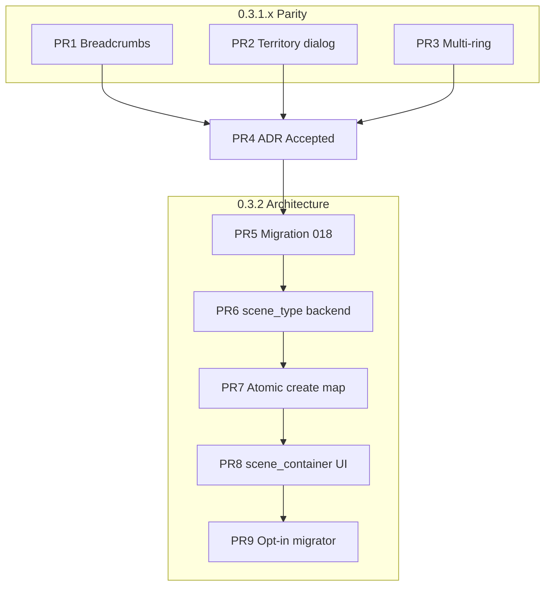

# 0.3.2 — Canvas architecture (scene types + scene_container)

**Статус:** план (implementation blocked on ADR Accepted)  
**ADR:** `docs/adr/ADR-0004-canvas-scene-types-and-scene-container.md` — **Proposed** (proposal docs in `f9061dfc0`; PR4 = review → **Accepted**)  
**Зависит от:** parity PR1–PR3; **PR5+** только после ADR-0004 Accepted

---

## Два трека

| Трек | Версия | Миграция схемы | Цель |
|------|--------|----------------|------|
| **Parity** | 0.3.1.x | **Нет** (017 достаточно) | Вернуть UX маркеров, территорий, вложенных карт как в старой «Карте» |
| **Canvas architecture** | 0.3.2 | **018+** (`scene_type`, `scene_container`) | Холст vs карта в модели, карточка карты на холсте, backend-инварианты |

Parity **не отменяется** этим планом: PR1–PR3 могут идти до PR4. Схемная работа (PR5+) начинается **после** принятия ADR-0004 (PR4).

**Project Graph** (`/project/:id/graph`, graph layouts, GraphCanvasShell) — **вне scope** всех PR ниже.

---

## Источники истины

| Документ | Роль |
|----------|------|
| ADR-0004 | scene_type, scene_container, matrix, invariants |
| `docs/prod/vision/canvas.md` | Продуктовое видение, этапность |
| `docs/plans/0.3.1.x-canvas-parity.md` | Parity без миграции |
| `docs/canvas-functional-gaps.md` | Регрессии и поля |
| `docs/canvas-debt.md` | Runtime-долг (не блокер architecture) |

---

## PR-очередь

Оценка: **S** ≈ 0.5–1 дн, **M** ≈ 1–3 дн, **L** ≈ 3–5 дн (solo dev, без E2E).

| PR | Название | Размер | Трек | Блокеры |
|----|----------|--------|------|---------|
| **PR1** | Parity breadcrumbs + navigation stack helper MVP | **M** | 0.3.1.x | A1 attach (готово) |
| **PR2** | Territory parity (диалог + поля) | **L** | 0.3.1.x | — |
| **PR3** | Multi-ring rendering | **M** | 0.3.1.x | C1 territory kind |
| **PR4** | ADR-0004 + vision + plan finalization | **S** | Docs | PR1–PR3 можно параллельно |
| **PR5** | Migration 018+ | **M** | 0.3.2 | PR4 Accepted |
| **PR6** | Backend scene_type support | **L** | 0.3.2 | PR5 |
| **PR7** | Atomic create map + scene_container | **M** | 0.3.2 | PR5, PR6 |
| **PR8** | Frontend scene_container MVP | **L** | 0.3.2 | PR7 |
| **PR9** | Legacy opt-in migration prompt | **M** | 0.3.2 | PR8 + анализ данных |

---

### PR1 — Parity breadcrumbs / navigation helper MVP

**Размер:** M · **Трек:** 0.3.1.x · **Схема:** нет

**Сделать:**

- Восстановить breadcrumbs для **nested maps через marker** (эталон HEAD:
  `MapToolbar`, `useMapNavigation`).
- Ввести pure helper **navigation stack**:
  `{ sceneId, label, via: 'root' | 'marker' | 'parent' }` (+ позже `'container'`).
- Push/pop при open/back; не опираться только на `getSceneTree`.
- **Vitest** на helper (push, pop, replace, same sceneId different `via`).

**Не делать:** `scene_container` UI, смена route, migration.

**Приёмка:** сценарий parity «вложенная карта у маркера → назад по crumbs»; unit-тесты green.

**Файлы (ориентир):** `frontend/src/pages/maps/` — toolbar, hook или
`canvas/navigationStack.ts`.

---

### PR2 — Territory parity

**Размер:** L · **Трек:** 0.3.1.x · **Схема:** нет

**Сделать:**

- Диалог/панель территории по HEAD (`MapTerritoryDialog` flow).
- Поля: `name`, `description`, `factionId`, `fill`, `opacity`,
  `borderColor`, `borderWidth`, `smoothing`, `rings[]` в текущих JSON.
- `kind: 'territory'` при создании; не путать с примитивом `polygon`.

**Не делать:** multi-ring render (PR3), scene_type.

**Приёмка:** шаги 4–5 приёмочного сценария в `0.3.1.x-canvas-parity.md`;
faction sync видит territory.

---

### PR3 — Multi-ring rendering

**Размер:** M · **Трек:** 0.3.1.x · **Схема:** нет

**Сделать:**

- `canvasReconciler`: для `territory` / `polygon` с `geometry.rings[]`
  рисовать **все** кольца (outer + islands/holes в пределах Pixi MVP).
- Fallback: legacy `geometry.points` → одно кольцо.

**Не делать:** полный inspector справа (можно позже), scene_container.

**Приёмка:** территория с несколькими кольцами видна; старые объекты с
`points` не ломаются.

---

### PR4 — ADR-0004 + docs finalization

**Размер:** S · **Трек:** Docs

**Сделать:**

- Принять ADR-0004 (status **Accepted**).
- Обновить `docs/prod/adr/README.md` index.
- Синхронизировать `docs/prod/vision/canvas.md` (этот PR или уже в doc batch).
- Ссылка из `docs/plans/0.3.1.x-canvas-parity.md` на этот план.
- При необходимости — строка Validation в ADR-0003 «Extended by ADR-0004»
  (append-only note, не ретро-правка решения 0003).

**Приёмка:** нет противоречий между ADR, vision, plan; AGENTS.md active
decisions при желании дополнить строкой 0004.

---

### PR5 — Migration 018+

**Размер:** M · **Трек:** 0.3.2

**Сделать:**

- `ALTER canvas_scene ADD COLUMN scene_type TEXT` (nullable).
- CHECK или app-level enum: `root_canvas`, `map`.
- Partial unique index: один `root_canvas` на `project_id`.
- Расширить `canvas_object.kind` CHECK: + `scene_container`.
- `CANVAS_OBJECT_KINDS` в Rust синхронно.
- **Не** backfill NULL → типы при миграции (см. ADR-0004).

**Решение зафиксировано:** nullable `scene_type` на transition; только
**новые** проекты получают `root_canvas` в `create_root_scene_for_project`
(логика в PR6, колонка в PR5).

**Приёмка:** fresh DB bootstrap; существующая тестовая БД открывается;
`cargo test` миграций.

---

### PR6 — Backend scene_type support

**Размер:** L · **Трек:** 0.3.2

**Сделать:**

- `get_root_scene`: `scene_type = 'root_canvas'`, fallback NULL +
  `parent_scene_id IS NULL`.
- `create_root_scene_for_project`: `scene_type = root_canvas`, без
  обязательного `background_path`.
- `validate_object_kind_for_scene` + matrix (ADR-0004), включая `icon`,
  `group`.
- Подключить к create/update/reconcile/bulk.
- Запрет self/ancestor `linked_scene_id`.

**Приёмка:** тесты matrix, root invariant, ancestor rejection; regression
`attach_child_scene_to_marker`.

---

### PR7 — Atomic create map + scene_container

**Размер:** M · **Трек:** 0.3.2

**Сделать:**

- Команда `canvas_create_map_with_scene_container` (имя по стилю проекта).
- TX: map scene + layers + container + `linked_scene_id` (+ optional
  `parent_object_id` на scene).
- Branch override как в `attach_child_scene_to_marker`.
- Tests: success, rollback без orphan, invalid parent not root_canvas.

**Приёмка:** `cargo test`; codegen; failed TX не увеличивает orphan scenes.

---

### PR8 — Frontend scene_container MVP

**Размер:** L · **Трек:** 0.3.2

**Сделать:**

- Reconciler/display: карточка «Карта», preview из linked scene
  `background_path`, `titleOverride`.
- Double-click / Open → navigate `/project/:id/map/:sceneId`, push stack
  `via: 'container'`.
- Создание карты: обязательное изображение (upload) → PR7 command.
- Toolset на `root_canvas`: разрешить `scene_container`; на `map` — нет.

**Приёмка:** greenfield: холст → добавить карту → открыть → breadcrumbs
со stack; marker nested flow не сломан.

---

### PR9 — Legacy opt-in migration prompt

**Размер:** M · **Трек:** 0.3.2 · **Условный**

**Сделать (после проверки реальных данных):**

- Detect: root NULL + `background_path` + map-like content.
- Opt-in dialog: преобразовать в `root_canvas` + `scene_container` + child
  `map` scene.
- **No silent migration.**

**Может быть отложен**, если у тестеров нет таких проектов.

---

## Связь с parity-планом

| Parity пункт | PR очереди |
|--------------|------------|
| B4 breadcrumbs | PR1 |
| C2 territory dialog | PR2 |
| C4 reconciler rings | PR3 |
| A1 attach marker | уже сделано; regression в PR6–PR7 |

Parity **out of scope** для architecture: `scene_container`, `scene_type`,
rename route, entity_ref, CV04 layers.

---

## Тесты (сводка)

| PR | Backend | Frontend |
|----|---------|----------|
| PR1 | — | vitest navigation helper |
| PR2 | territory + faction (при необходимости) | manual |
| PR3 | — | manual / unit geometry parse |
| PR5–7 | migration, matrix, TX, attach regression | — |
| PR8 | — | manual smoke |
| PR9 | migrator unit (если есть) | manual opt-in |

E2E и Pixi snapshot — не обязательны для MVP (ADR-0004 Validation).

---

## Риски

| Риск | Митигация |
|------|-----------|
| Два PR-трека параллельно | PR5+ только после PR4 Accepted |
| `createInitialScene` без default layers | Отдельный fix в PR6 или PR1 |
| icon/group на старых данных | Matrix в ADR-0004 |
| Цикл linked_scene | PR6 ancestor check |

---

*Документ подготовлен как планирование; код не менялся.*
